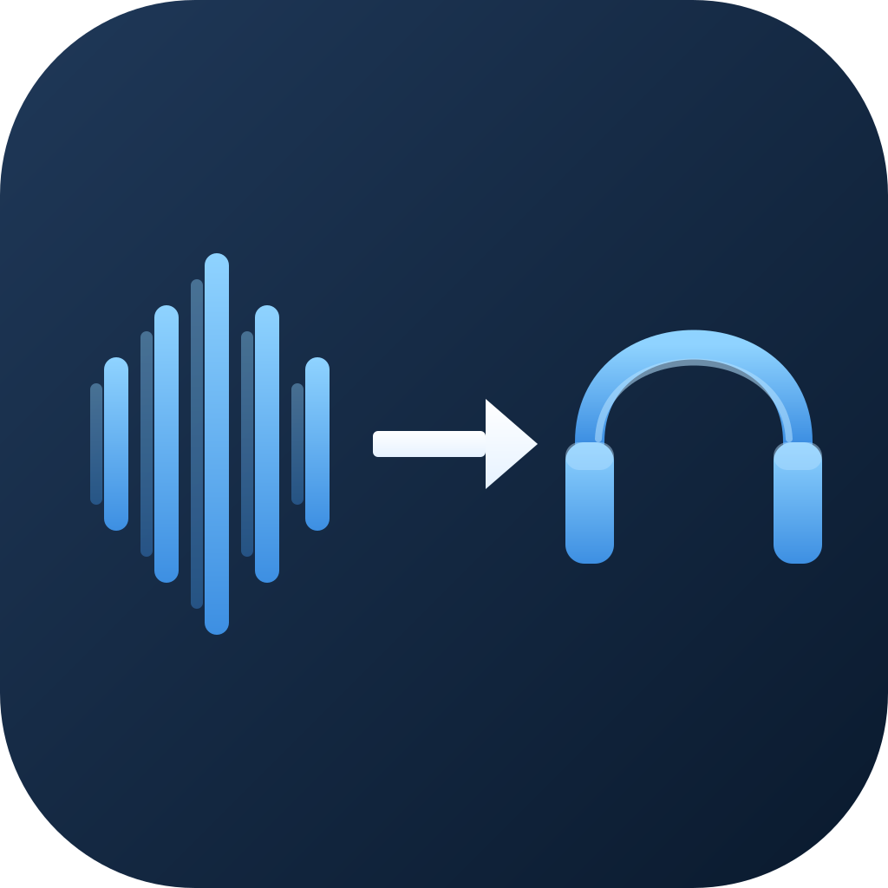

# SoundRoute

A tiny macOS menu bar utility that routes audio from any input device to any output device on your Mac. Pick a microphone, USB interface, or virtual input. Pick a pair of headphones, speakers, or AirPods. Press Start. Your audio flows in real time.

No drivers. No aggregate devices. No Audio MIDI Setup.

<p align="center">
  
</p>

## Why

macOS doesn't have a built-in way to send a specific input device to a specific output device without setting up an aggregate device or wrestling with a virtual audio kext. SoundRoute does exactly that, in two clicks, from the menu bar.

## Features

- Route any CoreAudio input to any CoreAudio output, in real time
- Lives in the menu bar — no Dock clutter, no main window
- Remembers your last selection across launches (by stable device UID)
- Hot-plug detection — connect AirPods or an interface and it appears immediately
- Optional launch at login (`SMAppService`)
- Optional Dock icon
- Right-click the menu bar icon for About / Privacy / Support / Quit
- Native SwiftUI + AppKit, no third-party dependencies

## Privacy

SoundRoute does not record, store, or transmit audio. It does not collect analytics. It does not connect to the internet. It pipes the user-selected input to the user-selected output, locally, and stops the moment you click Stop.

Microphone permission is required because macOS treats reading from any CoreAudio input device as microphone access — even if the input is a USB interface or line-in source. That permission is used only to read live audio frames into a small ring buffer that feeds the output device.

Full policy: <https://bscoggins.github.io/SoundRoute/privacy.html>

## Requirements

- macOS 14 (Sonoma) or later
- Microphone permission (granted on first Start)

## Install

Available on the Mac App Store: *(link will be added once the listing is live)*

## Build from source

```bash
git clone https://github.com/bscoggins/SoundRoute.git
cd SoundRoute
open SoundRoute.xcodeproj
```

Build with Xcode 26 or later. The project has no external dependencies.

To run on your own machine without a Developer ID, you may need to disable code signing under the SoundRoute target's Signing & Capabilities tab, or sign with your personal team.

## How it works

Two CoreAudio HAL Output AudioUnits are created — one configured for input capture, one for output playback. They are bridged by a lock-protected ring buffer (`OSAllocatedUnfairLock`) sized to `kAudioUnitProperty_MaximumFramesPerSlice` (4096 frames). The input unit's render callback writes captured frames into the ring; the output unit's render callback reads from it. Underruns zero-fill, overruns drop the oldest frames.

Device enumeration uses `AudioObjectGetPropertyData` against `kAudioHardwarePropertyDevices`, with a block-based property listener (`AudioObjectAddPropertyListenerBlock`) on the same property to react to hot-plug events on the main queue.

Selection persistence is keyed on each device's `kAudioDevicePropertyDeviceUID` (stable across reboots and reconnects), not the transient `AudioDeviceID`.

## Architecture

- `SoundRouteApp.swift` — `@main` entry; `AppDelegate` owns the `NSStatusItem`, `NSPopover`, and right-click context menu, and toggles activation policy for the Dock-icon preference.
- `ContentView.swift` — SwiftUI popover UI: device pickers, Start/Stop, mic-permission affordance, footer toggles.
- `AudioDeviceManager.swift` — CoreAudio device enumeration + hot-plug listener.
- `AudioManager.swift` — Two-AudioUnit routing engine and ring buffer.
- `PrivacyInfo.xcprivacy` — App Store privacy manifest declaring no tracking, no data collection, and `UserDefaults` access for `@AppStorage` persistence.

## Support

Issues, questions, or feedback: <https://bscoggins.github.io/SoundRoute/support.html>

## License

Copyright 2026 Michael Brent Scoggins. All rights reserved.
